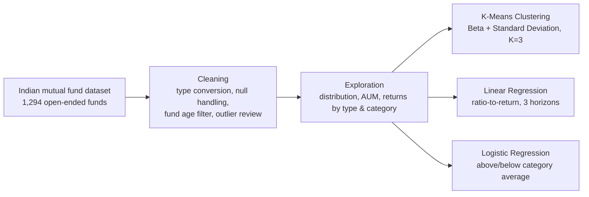

# Mutual Fund Analysis & Prediction

A structured, data-driven approach to analysing Indian mutual funds — using
unsupervised learning to group funds by volatility, and supervised learning
to test whether historical financial ratios can predict future returns.

Built as part of the Big Data Fundamentals module of an MSc in Financial
Technology.

---

## The problem

Investment drives economic growth, and mutual funds are one of the most
accessible instruments available to an ordinary investor — a pooled fund
invested across stocks, bonds and similar assets.

But choosing one is genuinely hard. There are over 2,500 funds in the
United States, around 3,000 in India, and roughly 5,000 in Canada. Each
carries dozens of parameters, and the investor's own goals and time
horizon add another layer of complexity on top. Modern platforms surface
enormous amounts of data about these funds, but data isn't the same as a
method — a novice investor still has no clear path from "here are 3,000
options" to "here is a balanced portfolio for my goals."

**This project asks two questions:**

1. How do you structurally analyse a mutual fund when so many options and
   parameters are involved?
2. Can returns be predicted from historical data?

The intent is explicitly **not** to recommend specific funds. It's to
demonstrate a repeatable analytical method, expose which features actually
matter, and test honestly whether historical ratios carry predictive
signal.

---

## Approach



*(Mermaid diagram renders on GitHub, not in a local markdown preview.)*

**Exploration** establishes the shape of the fund universe — how funds
distribute across types and categories, how assets concentrate across
fund houses, and how returns behave over different holding periods.

**Unsupervised analysis** groups funds by volatility using K-Means on Beta
and Standard Deviation. Investors tend to look at returns first; the point
of this stage is to make the *risk* side legible, so funds can be targeted
by risk appetite rather than by return alone.

**Supervised analysis** tests predictability two ways: linear regression
of returns against the single most important financial ratio for each
horizon (identified via a correlation heatmap, then a Random Forest
Regressor), and logistic regression classifying whether a fund beats its
own category average.

---

## Dataset

1,294 open-ended Indian mutual funds across 41 fund houses and 5 fund
types — Equity, Debt, Hybrid, Fund of Funds, and Gold — each further
categorised by the assets it holds.

### Schema

39 columns per fund, grouped by what they describe:

| Group | Columns |
|---|---|
| **Identity & classification** | `Fund House`, `Funds`, `Fund Manager`, `Category`, `classification`, `Rating` |
| **Size & cost** | `AUM(in Rs. cr)`, `ExpenseRatio (%)`, `Turnover Ratio (%)`, `No. of Stocks` |
| **Pricing & history** | `NAV`, `52 WeekHigh (NAV)`, `52 WeekLow (NAV)`, `Inception Date`, `Benchmark Index` |
| **Returns** | `Return (%)` at 1 mo, 3 mo, 6 mo, 1 yr, 2 yrs, 3 yrs, 5 yrs, 10 yrs |
| **Category benchmarks** | `category_average_return_1year`, `category_average_return_3years` |
| **Risk & performance ratios** | `Alpha`, `Beta`, `Sharpe`, `Sortino`, `Standard Deviation` |
| **Equity holdings profile** | `Avg. Market Cap(in Rs. cr)`, `Large Cap(%)`, `Mid Cap(%)`, `Small Cap(%)`, `Highest Sector` |
| **Debt holdings profile** | `Avg. Maturity(in yrs)`, `Mod. Duration(in yrs)`, `Yield To Maturity (%)` |
| **Other** | `Exit_load_Remarks` |

The equity and debt profile groups are mutually exclusive by design — a
Debt fund has no market-cap split, an Equity fund has no yield-to-maturity
— which is a large part of why null density is so high in the raw file and
why the >30% null rule removes real columns rather than junk ones.

**Columns dropped during cleaning** (>30% missing): `Return (%)5 yrs`,
`Return (%)10 yrs`, `Avg. Market Cap(in Rs. cr)`, `Mod. Duration(in yrs)`,
`Yield To Maturity (%)`. Losing the 5- and 10-year returns is the most
consequential of these — it's why the analysis caps at a 3-year horizon.

A sample of actual rows is visible in the notebook's saved output at the
`df_mfs.head()` step, immediately after the load.

**Cleaning and transformation steps:**

- **Fund Type and Fund Category** weren't cleanly represented in the source
  data. Both were derived into new columns, since all downstream
  classification depends on them.
- **Every column arrived typed as `object`**, because missing values were
  encoded as `'-'` rather than left blank. These were converted to nulls
  first, then each column cast to its correct type.
- **Fund age was filtered** to funds created up to December 2020, so that
  every retained fund has enough history for the return horizons under
  analysis.
- **Columns with more than 30% missing values were dropped** entirely.
  Remaining gaps were filled with the column median, which limits the pull
  of extreme values.
- **Outliers were detected but deliberately retained** — a fund with an
  unusually large gain or loss is legitimate financial data, not noise.

The raw data file isn't included in this repository — it's third-party
data, not this project's to redistribute. To run the notebook, source an
equivalent dataset of Indian open-ended mutual funds and point the load
step at it.

---

## What the analysis found

**Fund universe and structure**

- Funds concentrate heavily in ETF, Equity Oriented and Index categories —
  all Equity funds, which offer higher returns and carry higher expense
  ratios, suited to investors with a longer horizon and higher risk
  appetite.
- Beyond that concentration, categories such as Solution Oriented
  (Hybrid), Gilt (Debt), and Overseas (Fund of Funds) also deliver
  meaningful returns — the raw material for a balanced portfolio rather
  than an all-equity one.
- **AUM is highly concentrated:** 8 fund houses manage the majority of
  total assets under management across all 41.
- AUM cuts differently by fund type: for Equity funds, consistency of
  returns matters more than size, and a high AUM can actually work against
  returns; for Debt funds, a larger AUM helps spread fixed expenses across
  more investors.

**Returns behaviour**

- **1-year equity returns skew negative while 2- and 3-year returns are
  positive** — direct evidence for holding equity investments at least two
  years rather than treating them as short-term instruments.
- Across fund types, the expected risk/return ordering holds and is
  quantified: Equity delivers the highest returns with the highest risk,
  Debt the lowest returns with the greatest stability, and Hybrid sits
  between the two — good returns at moderate risk.

**Volatility clustering (K-Means, K=3)**

The three clusters turned out to be interpretable rather than arbitrary,
which is what makes them usable:

- **Cluster 0 — high volatility, 90% with moderate variation in returns.**
  Mostly Equity funds, as expected given their direct market exposure. But
  it also caught **Debt funds that are usually assumed to be safe** —
  drilling in showed these are largely gilt funds, which are genuinely
  volatile in nature. About 41% of Hybrid funds land here too.
- **Cluster 1 — moderate volatility, low variation in returns.** 95% of
  Debt funds sit here, as expected, along with the remaining 58% of Hybrid
  funds — notably Hybrid Arbitrage funds, which appeal to investors
  wanting to profit from volatile markets without taking on the risk.
- **Cluster 2 — lowest volatility, high variation in returns.** Contains
  Debt funds such as Credit Risk and Dynamic Bond, whose returns track
  interest-rate movements and therefore vary more.

The practical payoff: an investor can target a cluster matching their risk
appetite, and the clustering surfaces mismatches between a fund's
reputation and its actual behaviour — the gilt funds being the clearest
example.

**Return predictability**

- A correlation heatmap showed **Alpha correlates strongly with 1-year
  returns**, but revealed **no clear pattern for 2- and 3-year returns** —
  the first sign that predictability weakens with horizon.
- A Random Forest Regressor was used to rank ratio importance per horizon,
  identifying Alpha for 1 year, Beta for 2 years, and Standard Deviation
  for 3 years.
- **Linear regression against the top-ranked ratio worked reasonably for
  1-year returns and poorly for 2- and 3-year returns.** As the investment
  period lengthens, a single ratio stops being sufficient — multiple
  ratios and fund characteristics start influencing the outcome together.
- **Logistic regression** classifying funds as above or below their
  category average, using the Sharpe ratio as predictor, showed the same
  pattern: a better model at 1 year, declining accuracy at 3 years, likely
  as factors such as expense fees begin to matter more.

---

## Reflections

The initial analysis confirmed and quantified the risk/return structure of
the fund universe — Equity for long-horizon, high-risk-appetite investors;
Debt for stability and low risk; Hybrid as the middle ground.

The clustering stage was the most genuinely insightful part. Grouping by
volatility gave a clear path to targeting a relevant set of funds, and it
worked well enough that the obvious extension is to cluster on additional
ratios and see what other perspectives emerge.

The regression results are the honest limitation of the project: accuracy
was good at short horizons and degraded at longer ones. The most likely
explanation is the deliberate use of a *single* financial ratio per
horizon. A composite predictor combining multiple ratios and fund
characteristics is the natural next step. The treatment of outliers may
also matter — but with financial data, that calls for careful analysis
rather than removing them outright.

Overall this is a working, structured method for analysing mutual funds
and testing return predictability — a foundation that extends naturally
with more ratios and richer scenarios.

---

## Possible future enhancements

Built to a coursework scope. If extended today:

- **Multivariate return prediction.** Regress on all seven financial ratios
  at once (Ridge/Lasso, or a tree-based ensemble) rather than the single
  top-ranked ratio per horizon — the direct answer to the weak 2- and
  3-year results above.
- **Clustering across more features.** Extend K-Means beyond Beta and
  Standard Deviation to add further risk perspectives, and compare against
  the current 3-cluster result.
- **Time-based validation.** This dataset is a point-in-time snapshot;
  re-testing the same relationships against more recent data would show
  whether they still hold.
- **Reproducible, tracked experiments.** Fix random seeds across every
  train/test split and log parameters and metrics (e.g. via MLflow) so
  results regenerate exactly.
- **A deployable scoring function.** Wrap the trained models as a small CLI
  or API — given a fund's ratios, return a predicted return band and
  volatility cluster — turning static notebook output into something
  runnable on demand.

---

## Repository structure

```
├── notebook/
│   └── Mutual_Fund_Analysis_and_Prediction.ipynb   # full analysis
├── docs/
│   └── architecture-decisions.md                   # key design choices & rationale
├── requirements.txt
└── README.md
```

## Running it

```bash
python -m venv venv
source venv/bin/activate        # venv\Scripts\activate on Windows
pip install -r requirements.txt
```
Open `notebook/Mutual_Fund_Analysis_and_Prediction.ipynb`, place a copy of
the source data (see Dataset, above) alongside it, and run top to bottom.

Originally developed on Python 3.9.

## Author
Akshay Salunke | AWS Solutions Architect | MSc Financial Technology | [LinkedIn]https://linkedin.com/in/akshayksalunke

© 2026 Akshay Salunke. All rights reserved. This code is shared for portfolio and demonstration purposes only; no license is granted for reuse, modification, or redistribution.
